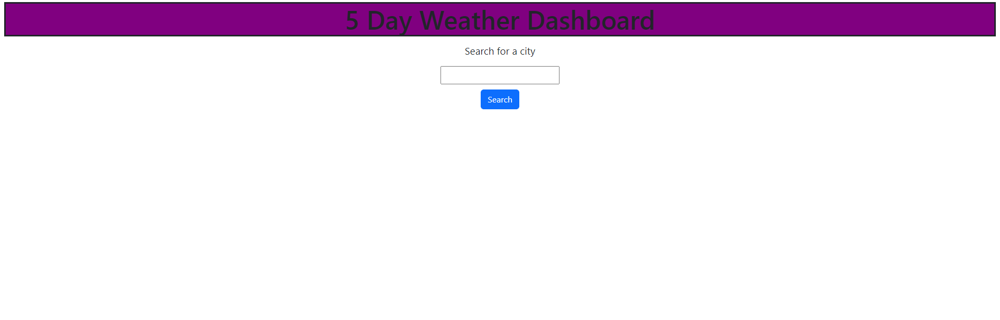

<h1>UW BootCamp Week 6 Challenge<h1> 

<h2>Table of contents<h2>

<ul>
    <li>General information
    <li>Setup 
    <li>License
    <li>Screenshots
    <li>Acceptance Criteria
    <li>Links
<ul>

<h3>
General infromation<h3>
    The Useage of this website is so that i can check the next 5 days weather of the city that I will be headed to 
    

<h3>
Setup<h3>`
    This repo contains multiply images along with 1 Html ,1 Css style Sheet,1 javascript ,1 readme.md file and a mit license. 
    
<h3>
License<h3>
This repo uses the MIT license 

Copyright <2022> <MIT HOLDER>

Permission is hereby granted, free of charge, to any person obtaining a copy of this
software and associated documentation files (the "Software"), to deal in the Software
without restriction, including without limitation the rights to use, copy, modify,
merge, publish, distribute, sublicense, and/or sell copies of the Software, and to
permit persons to whom the Software is furnished to do so.

THE SOFTWARE IS PROVIDED "AS IS", WITHOUT WARRANTY OF ANY KIND, EXPRESS OR IMPLIED,
INCLUDING BUT NOT LIMITED TO THE WARRANTIES OF MERCHANTABILITY, FITNESS FOR A
PARTICULAR PURPOSE AND NONINFRINGEMENT. IN NO EVENT SHALL THE AUTHORS OR COPYRIGHT
HOLDERS BE LIABLE FOR ANY CLAIM, DAMAGES OR OTHER LIABILITY, WHETHER IN AN ACTION
OF CONTRACT, TORT OR OTHERWISE, ARISING FROM, OUT OF OR IN CONNECTION WITH THE
SOFTWARE OR THE USE OR OTHER DEALINGS IN THE SOFTWARE.

<h3>
Screenshots<h3>
Below is a screesnshot of how the website should look

Below is another screenshot of how the actual deployed website looks like

)

<h3>
Accetance Criteria<h3>
GIVEN a weather dashboard with form inputs
WHEN I search for a city
THEN I am presented with current and future conditions for that city and that city is added to the search history
WHEN I view current weather conditions for that city
THEN I am presented with the city name, the date, an icon representation of weather conditions, the temperature, the humidity, and the the wind speed
WHEN I view future weather conditions for that city
THEN I am presented with a 5-day forecast that displays the date, an icon representation of weather conditions, the temperature, the wind speed, and the humidity
WHEN I click on a city in the search history
THEN I am again presented with current and future conditions for that city

<h3>
Links<h3>
Below is a link to the actual deployed application
 
 https://kenghoufong1.github.io/UwWeek3Challenge/